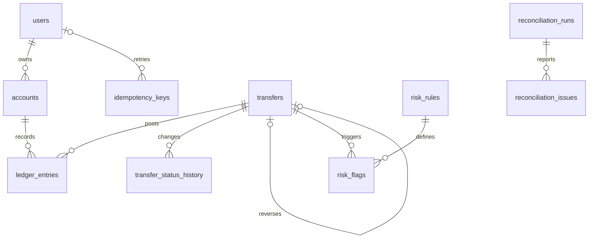

# Schema

Design agreed before application code, 9 October 2026. PostgreSQL 16, UTF-8, INR only. Money is positive integer paise with a separate debit/credit direction. Debits reduce an account balance; credits increase it. System balances can be negative.

| Noun | Table or representation | Reason |
| --- | --- | --- |
| User | users | Identity, contact details and KYC |
| Wallet, system account | accounts | Same ledger participation, different ownership and balance constraints |
| Currency | accounts.currency | INR only; a separate currency catalogue is unnecessary |
| Transfer, reversal | transfers | Business event; reversal links to the original |
| Debit, credit | ledger_entries.direction | Direction of a line, not a separate entity |
| Ledger entry | ledger_entries | Immutable account movement |
| Client request/key | idempotency_keys | Request fingerprint and original response |
| Status change | transfer_status_history | Actor, previous/new status and time |
| Fraud rule | risk_rules | Configurable thresholds |
| Flag | risk_flags | Trigger and explanation |
| Reconciliation run/problem | reconciliation_runs, reconciliation_issues | Run summary and mismatch evidence |
| Job lock | job_locks | Exclusive scheduled/manual execution |

All tables use generated BIGINT IDs. Users have many accounts; accounts optionally belong to one user. Transfers have many ledger entries and history rows; each entry belongs to one account. Transfers can reference one original transfer; at most one full reversal is allowed. Rules and transfers form M:N through flags. Runs have many issues. Idempotency records belong to a caller namespace (user, admin, or onboarding) and optionally reference a user.

Foreign keys sit on the many side; the self-reference handles reversal. Unique constraints cover system account kinds, user/key pairs, caller/key pairs and original reversals. Status values and ownership combinations use CHECK constraints. Deferred constraint triggers enforce balanced entries and matching stored balances at commit. Ledger UPDATE/DELETE and TRUNCATE are prohibited. Account balance changes must agree with entries. Failed transactions leave no money movement.

Balances are stored for locked spending checks and computed from entries for verification. This makes reads inexpensive at the cost of updating both within the same transaction. Email and phone are caller-controlled and can change; generated IDs provide stable references.

Statements use (account_id, created_at DESC, id DESC). Risk history uses (source_account_id, created_at DESC) for posted outgoing transfers, plus recipient lookups. Each index adds maintenance cost on writes. Reconciliation can scan the ledger nightly; foreign keys and account/transfer indexes support grouping and lookup.

Held and rejected transfers have zero entries; posted and reversed originals retain their complete entries. Reversing an original creates another posted transfer and changes the original status to reversed, without editing its entries. Rejecting a hold is a status decision, not a ledger reversal.
